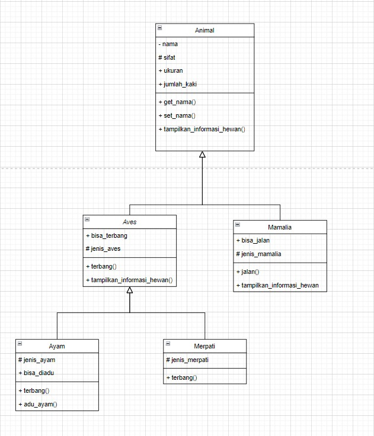

## Pemrograman Objek Berorientasi Objek Praktik - Kelas VII
Fakultas: Sains dan Teknologi\
Prodi: Informatika\
Pertemuan: 9\
Ruang: L.K 2.3\
Jenis Tugas: Tugas Kelompok\
Kelompok: 7

## Anggota 
1. Echa Apriliyanto
   5220411272
2. Mochamad Fauzan Pratama Putra Sudiana
   5220411275

## Keterangan File
Kode Porgram: 
> STUDI KASUS MINGGU-9 PBO VII.py

Powerpoint:
> PPT_pertemuan9_kelompok .pdf

Class Diagram:
> class-diagram.jpg


## UML CLASS DIAGRAM


## Output kode program studi kasus pertemuan-9
```Nama:  paus biru
Sifat:  Karnivora
Ukuran:  besar
Jumlah Kaki:  0
Jenis Mamalia:  paus
Bisa Berjalan:  False

paus tidak bisa berjalan      


Nama:  kucing
Sifat:  Karnivora
Ukuran:  kecil
Jumlah Kaki:  4
Jenis Mamalia:  kucing        
Bisa Berjalan:  True

kucing ~tap tap tap~


Nama:  burung unta
Sifat:  Herbivora
Ukuran:  besar
Jumlah Kaki:  2
Jenis Aves:  burung unta      
Bisa Terbang:  False

burung unta tidak bisa terbang


Nama:  elang jawa
Sifat:  Karnivora
Ukuran:  sedang
Jumlah Kaki:  2
Jenis Aves:  elang jawa
Bisa Terbang:  True

elang jawa terbang ~wush~


Nama:  ayam hias
Sifat:  Omnivora
Ukuran:  kecil
Jumlah Kaki:  2
Jenis Aves:  ayam
Bisa Terbang:  False
Bisa Diadu:  False

ayam hias tidak bisa terbang
ayam hias tidak bisa diadu


Nama:  ayam bangkok
Sifat:  Omnivora
Ukuran:  kecil
Jumlah Kaki:  2
Jenis Aves:  ayam
Bisa Terbang:  False
Bisa Diadu:  True

ayam bangkok tidak bisa terbang
ayam bangkok beradu


Nama:  ayam hutan
Sifat:  Omnivora
Ukuran:  kecil
Jumlah Kaki:  2
Jenis Aves:  ayam
Bisa Terbang:  True
Bisa Diadu:  True

ayam hutan terbang menurun~
ayam hutan beradu


Nama:  merpati kipas
Sifat:  Omnivora
Ukuran:  kecil
Jumlah Kaki:  2
Jenis Aves:  merpati
Bisa Terbang:  True

merpati kipas terbang dengan indah~```
